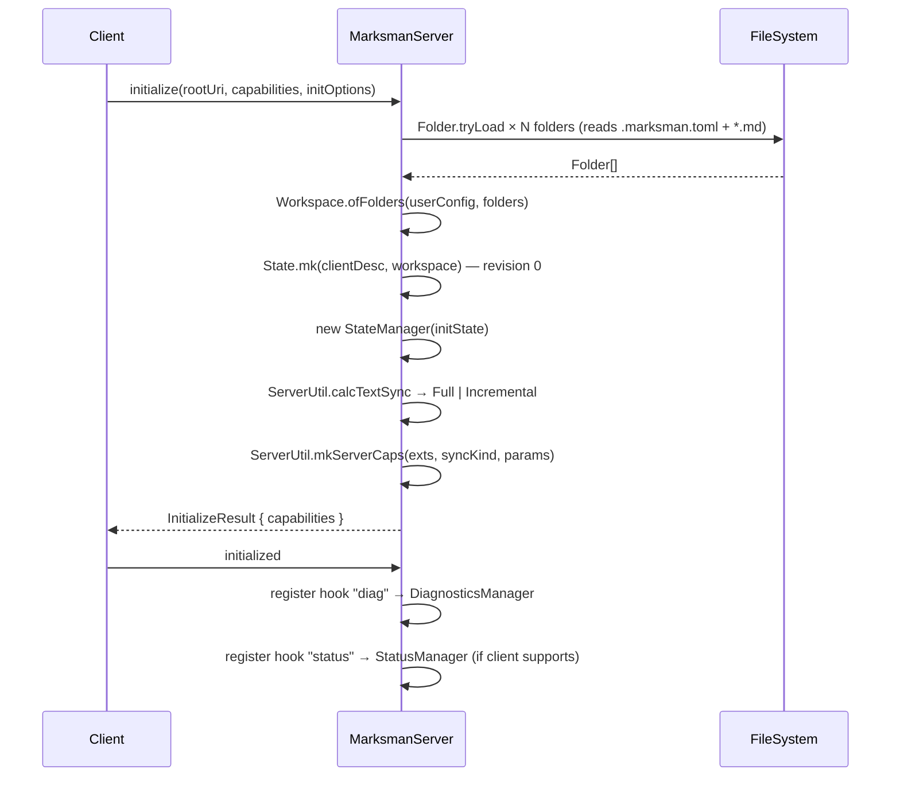
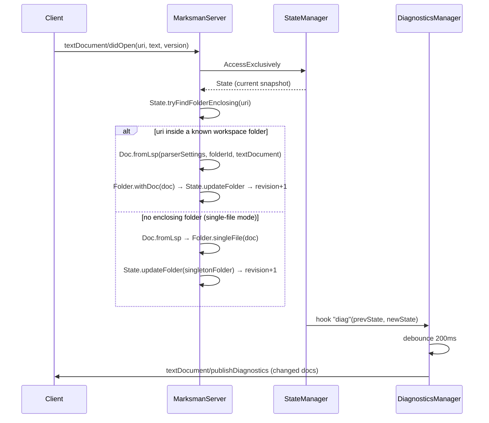
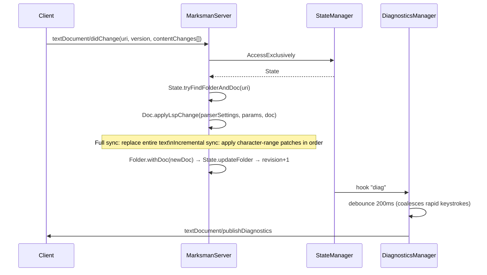
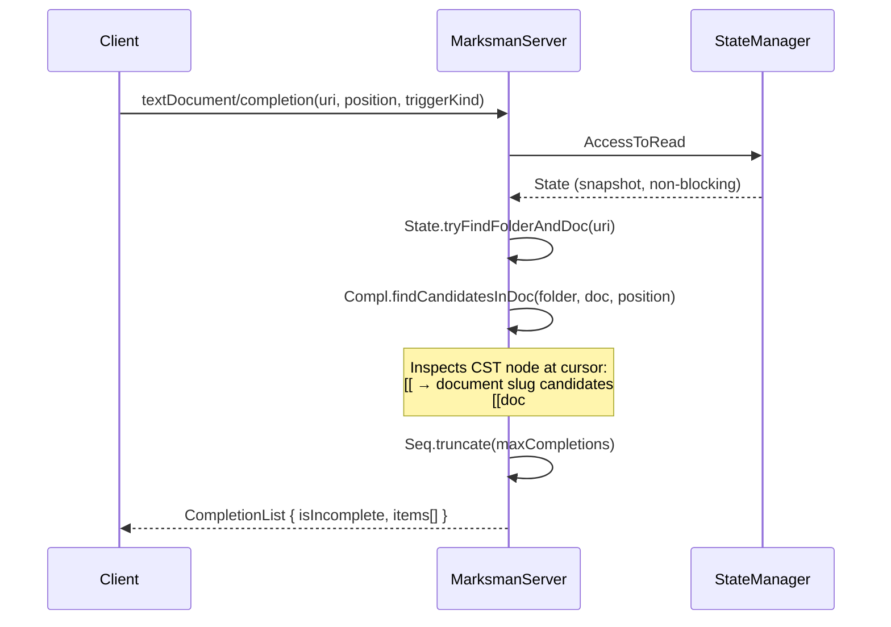
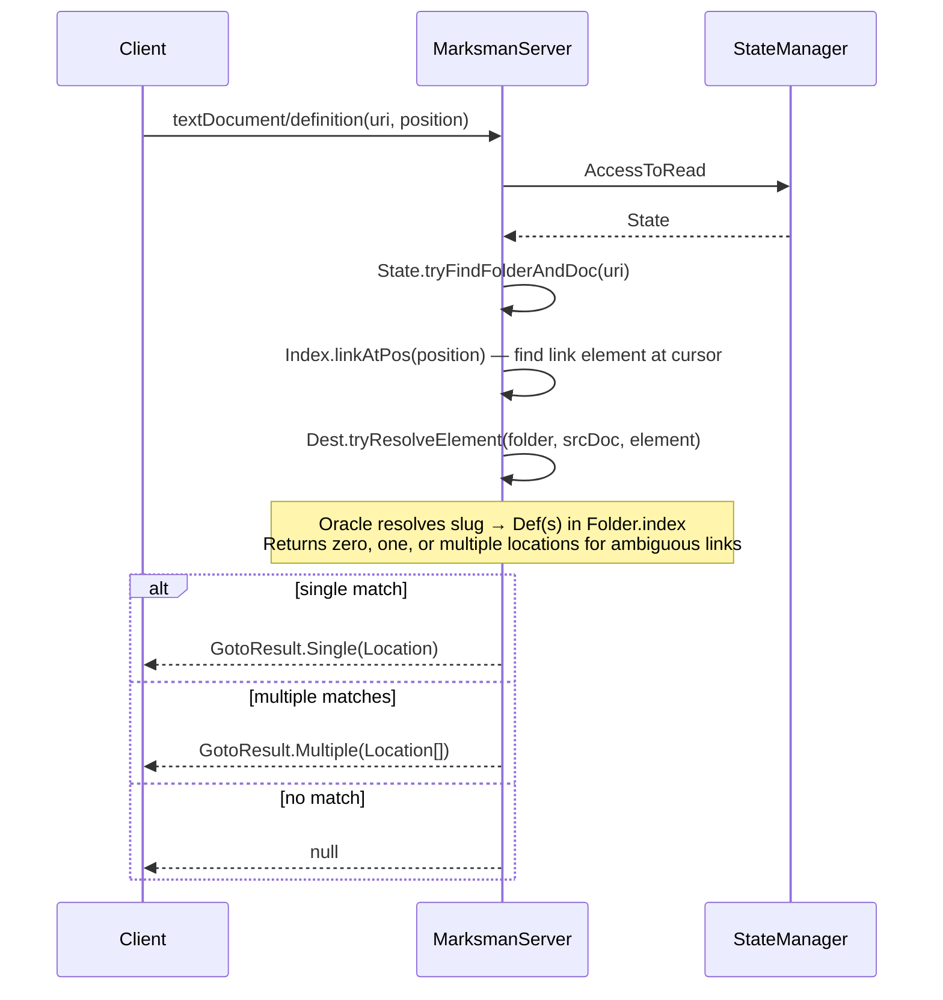
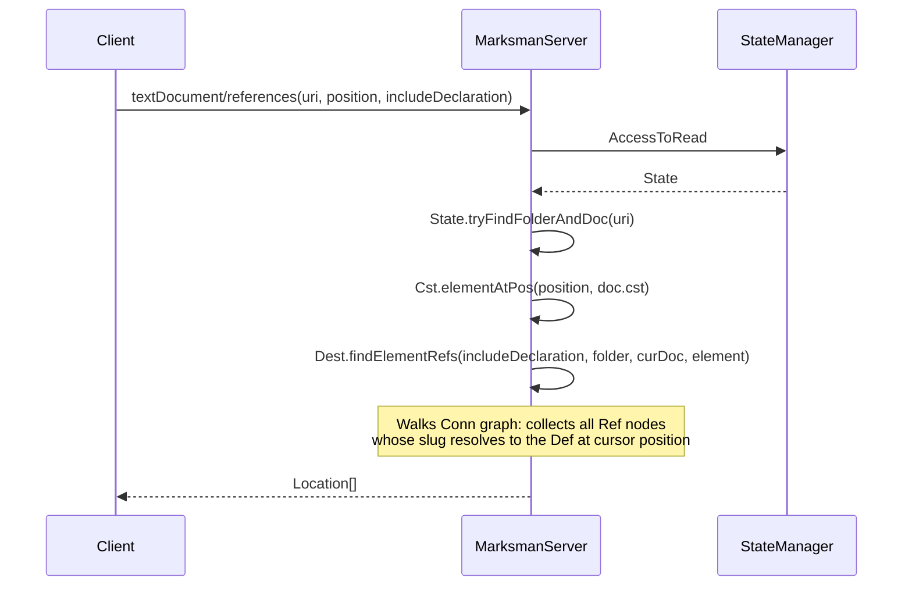
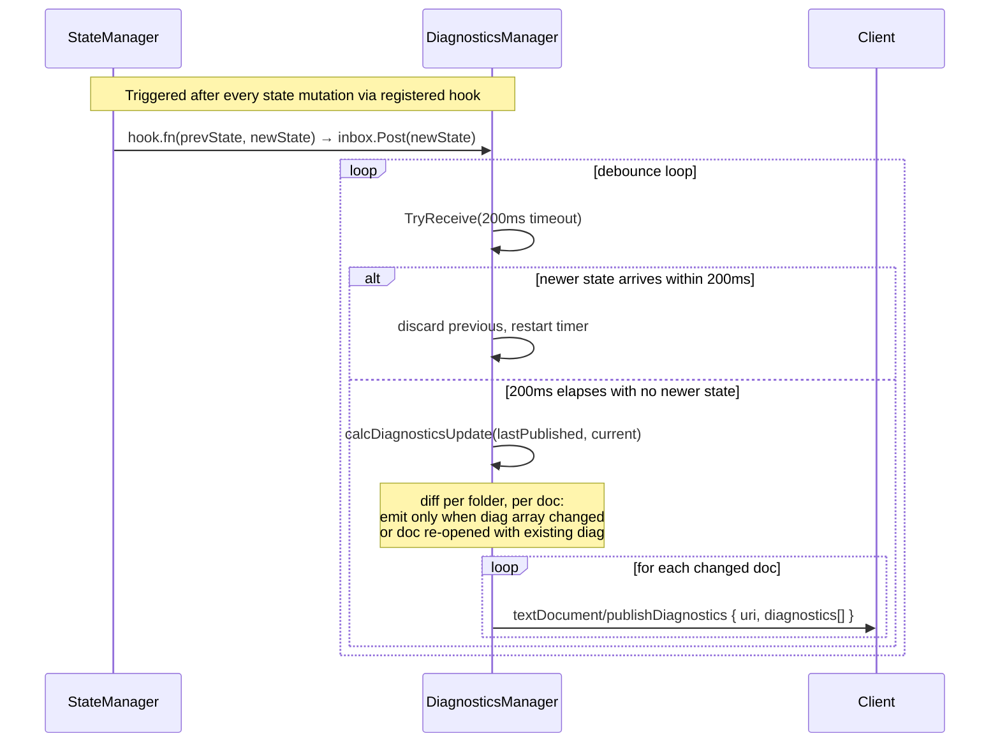
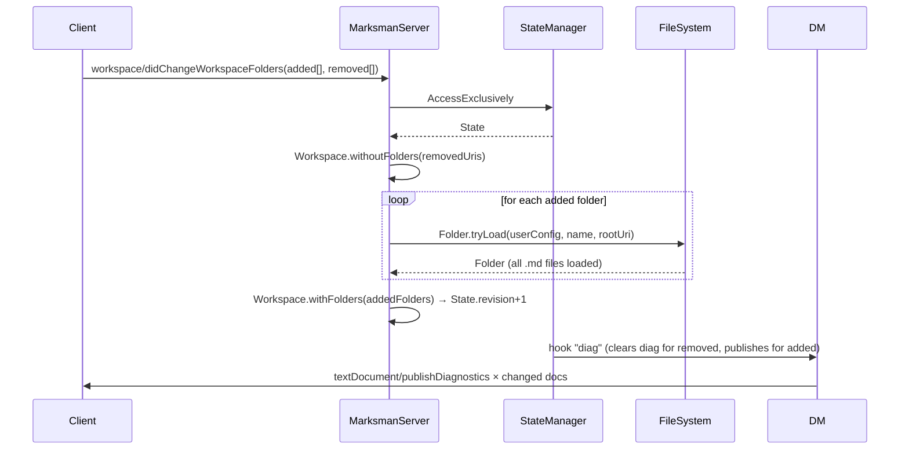

# API Layer

LSP 3.17 protocol surface implemented by Marksman: method catalog, capability negotiation, concurrency model, and sequence diagrams for every major request flow.

> [!NOTE] Scope
> This document covers the JSON-RPC wire layer and request-dispatch machinery in `Server.fs` and `State.fs`. For the domain model beneath the handlers see [[design/domain-layer|Domain Layer]]. For behavioural contracts expressed as BDD scenarios see [[design/behavior-layer|Behavior Layer]]. For LSP specification background see [[research/lsp/02-json-structures|LSP 3.17 — JSON Structures]].

---

## Transport

Marksman speaks **LSP 3.17 over stdin/stdout** using `StreamJsonRpc` wrapped by the `LanguageServerProtocol/` F# project. All frames are JSON-RPC 2.0 with `Content-Length` headers per the base protocol.

Key constraints:

- One process per workspace — no socket or named-pipe mode.
- The client owns process lifetime; shutdown follows the standard two-step `shutdown` → `exit` sequence.
- All state reads and mutations are serialised through a single `MailboxProcessor` (`StateManager`) to eliminate races on shared workspace state.
- Diagnostics are pushed asynchronously by a background agent with a 200 ms debounce so rapid keystrokes do not trigger redundant recomputation.

---

## Capability Negotiation

Capabilities are computed once during `initialize` and are not updated dynamically (workspace-folder additions are handled via `workspace/didChangeWorkspaceFolders`, not capability re-registration).

| Capability | Condition | Advertised value |
|------------|-----------|-----------------|
| `textDocumentSync` | always | `OpenClose: true`, `Change: Full\|Incremental` (negotiated — see below) |
| `completionProvider` | always | trigger characters: `[`, `#`, `(` |
| `definitionProvider` | always | `true` |
| `hoverProvider` | always | `true` |
| `referencesProvider` | always | `true` |
| `documentSymbolProvider` | not VSCode | `true` |
| `workspaceSymbolProvider` | not VSCode | `true` |
| `codeActionProvider` | always | no kinds restriction; `resolveProvider: false` |
| `semanticTokensProvider` | always | full + range; no delta |
| `codeLensProvider` | always | `resolveProvider: false` |
| `renameProvider` | always | `PrepareProvider: true` if client advertises `rename.prepareSupport` |
| `workspace/workspaceFolders` | always | supported + change notifications |
| `workspace/fileOperations` | always | `didCreate` + `didDelete`; `didRename` disabled (VSCode sends `didClose` + `didOpen` for renames) |

### Text-Sync Kind Selection

The sync kind is resolved in priority order at `initialize` time:

```
workspace .marksman.toml  →  user config  →  client InitializationOptions  →  default (Full)
```

Incremental sync is more efficient for large files; Full is the safe fallback and the default.

---

## Method Catalog

All implemented LSP methods. **Access** column: **R** = read-only snapshot via `AccessToRead`; **W** = exclusive write via `AccessExclusively`.

### Lifecycle

| Method | Access | Key function | Notes |
|--------|--------|--------------|-------|
| `initialize` | — | `ServerUtil.extractWorkspaceFolders` / `Folder.tryLoad` | Reads filesystem, builds `Workspace`, creates `StateManager` |
| `initialized` | W | — | Registers `diag` hook; conditionally registers `status` hook |
| `shutdown` | — | — | No-op; client will send `exit` next |
| `exit` | — | — | No-op; process terminates |

### Document Synchronisation

| Method | Access | Key function | Notes |
|--------|--------|--------------|-------|
| `textDocument/didOpen` | W | `Doc.fromLsp`, `Folder.withDoc` | Creates singleton folder if no enclosing folder exists (single-file mode) |
| `textDocument/didChange` | W | `Doc.applyLspChange` | Applies full-text replacement or incremental character-range patches |
| `textDocument/didClose` | W | `Folder.closeDoc` | Drops singleton folder when its only doc is closed |

### Language Features

| Method | Access | Key function | Notes |
|--------|--------|--------------|-------|
| `textDocument/completion` | R | `Compl.findCandidatesInDoc` | Candidates capped at `ComplCandidates()` (config); `isIncomplete` set when cap reached |
| `textDocument/definition` | R | `Dest.tryResolveElement` | Returns `GotoResult.Single` or `GotoResult.Multiple` |
| `textDocument/hover` | R | `Dest.tryResolveElement` | Returns first resolved destination's text as a Markdown hover |
| `textDocument/references` | R | `Dest.findElementRefs` | Walks `Conn` graph; honours `includeDeclaration` flag |
| `textDocument/documentSymbol` | R | `Symbols.docSymbols` | Hierarchical mode for clients that support it; flat for Emacs |
| `textDocument/semanticTokens/full` | R | `Semato.Token.ofIndexEncoded` | Whole-document token array |
| `textDocument/semanticTokens/range` | R | `Semato.Token.ofIndexEncodedInRange` | Range-restricted token array |
| `textDocument/codeAction` | W | `CodeActions.tableOfContents` / `createMissingFile` | TOC upsert (`Source` kind); create-missing-file quick-fix (`QuickFix` kind) |
| `textDocument/codeLens` | R | `Lenses.forDoc` | Find-references count lens per heading |
| `textDocument/prepareRename` | W | `Refactor.renameRange` | Returns rename range; `null` if cursor is not on a renameable element |
| `textDocument/rename` | W | `Refactor.rename` | Multi-file `WorkspaceEdit`; uses `documentChanges[]` if client supports it |

### Workspace Features

| Method | Access | Key function | Notes |
|--------|--------|--------------|-------|
| `workspace/symbol` | R | `Symbols.workspaceSymbols` | Filters by query string across all folders |
| `workspace/didCreateFiles` | W | `Doc.tryLoad`, `Folder.withDoc` | Loads newly created `.md` files into enclosing folder |
| `workspace/didDeleteFiles` | W | `Folder.withoutDoc` | Removes deleted docs; drops folder if now empty |
| `workspace/didChangeWorkspaceFolders` | W | `State.updateFoldersFromLsp` | Unloads removed roots; loads all `.md` files under added roots |
| `workspace/executeCommand` | R | — | Dummy no-op for the find-references code-lens command (client handles display) |

### Custom Notifications (Server → Client)

| Method | Payload | When |
|--------|---------|------|
| `textDocument/publishDiagnostics` | `PublishDiagnosticsParams` | After any state mutation, debounced 200 ms; diff-only (unchanged docs suppressed) |
| `marksman/status` | `{ state: string; docCount: int }` | When doc count changes; only if client sets `experimental.statusNotification: true` |

---

## Concurrency Model

Three `MailboxProcessor` agents serialise all shared state access:

```
┌─────────────────────────────────────────────────────────────────┐
│  StreamJsonRpc thread pool                                       │
│                                                                  │
│  didOpen     completion    definition    didChange    rename … │
└────────┬──────────┬────────────┬──────────┬──────────┬──────────┘
         │          │            │          │          │
         └──────────┴────────────┴──────────┴──────────┘
                               │
                    ┌──────────▼──────────┐
                    │   StateManager      │
                    │   MailboxProcessor  │
                    │                     │
                    │  ReadState  → snap  │ ← AccessToRead (R handlers)
                    │  MutateState → new  │ ← AccessExclusively (W handlers)
                    │  revision+1, hooks  │
                    └──────────┬──────────┘
                               │ after each mutation: run hooks
                  ┌────────────┴────────────┐
                  │                         │
       ┌──────────▼──────────┐   ┌──────────▼──────────┐
       │  DiagnosticsManager │   │   StatusManager      │
       │  MailboxProcessor   │   │   MailboxProcessor   │
       │  200ms debounce     │   │   doc-count dedup    │
       └──────────┬──────────┘   └──────────┬───────────┘
                  │                         │
       ┌──────────▼─────────────────────────▼───────────┐
       │                 LSP Client                       │
       │  publishDiagnostics         marksman/status      │
       └──────────────────────────────────────────────────┘
```

**StateManager guarantees:**

- All handlers run under the same mailbox — no concurrent mutations.
- Read-only handlers get a consistent snapshot without blocking each other.
- Each mutation produces a new immutable `State` record with `revision + 1`.
- Hooks receive `(prevState option, newState)` for diffing.
- A fatal exception inside any mutator calls `Fatality.abort` and crashes the process intentionally — corrupt state is never silently retained.

**DiagnosticsManager debounce logic:**

```
loop:
  receive newState
  wait 200ms for another state (TryReceive)
  if another arrived → discard old, loop
  else → calcDiagnosticsUpdate(lastPublished, current)
       → publish only changed docs
       → loop (waiting for next mutation)
```

Diagnostics are re-published for a previously-closed doc when it is re-opened, even if the diagnostic array has not changed.

---

## Sequence Diagrams

### 1 · Initialize Handshake



### 2 · Document Open



### 3 · Document Change



### 4 · Completion



### 5 · Go-to-Definition



### 6 · Find References



### 7 · Rename (two-step)

```mermaid
sequenceDiagram
    participant C as Client
    participant S as MarksmanServer
    participant SM as StateManager

    note over C,S: Step 1 — prepare (client checks cursor is renameable)
    C->>S: textDocument/prepareRename(uri, position)
    S->>SM: AccessExclusively
    SM-->>S: State
    S->>S: Refactor.renameRange(srcDoc, position)
    alt cursor on renameable element
        S-->>C: PrepareRenameResult.Range { range }
    else not renameable
        S-->>C: null (rename rejected)
    end

    note over C,S: Step 2 — execute
    C->>S: textDocument/rename(uri, position, newName)
    S->>SM: AccessExclusively
    SM-->>S: State
    S->>S: State.tryFindFolderAndDoc(uri)
    S->>S: Refactor.rename(supportsDocEdit, folder, srcDoc, position, newName)
    note over S: Collects all cross-doc Refs → builds WorkspaceEdit<br/>documentChanges[] if client supports; changes{} fallback
    S-->>C: WorkspaceEdit
    C->>C: Apply edits to open buffers
```

### 8 · Diagnostic Push (background)



### 9 · Workspace Folder Change



---

## State Lifecycle

Each `State` is an **immutable snapshot**. Mutations produce a new record with `revision + 1`; the `StateManager` retains the previous snapshot only for hook diffing.

```
initialize
    │
    ▼
State(rev=0, workspace=W₀, client=C)
    │
initialized → register hooks (no revision change)
    │
    ├── textDocument/didOpen    → State(rev=1, workspace=W₀+doc)
    ├── textDocument/didChange  → State(rev=2, workspace=W₁)
    ├── textDocument/didClose   → State(rev=3, workspace=W₂)
    ├── workspace/did*          → State(rev=N, workspace=Wₙ)
    │
    │   (every mutation triggers DiagnosticsManager + StatusManager hooks)
    │
shutdown → no-op
exit     → process terminates; all MailboxProcessors disposed
```

---

## Error Handling

| Scenario | Behaviour |
|----------|-----------|
| Document not found on `didChange` / `didClose` | Logged as warning; returns `Mutation.empty` — no state change, no crash |
| `initialize` throws | `Fatality.abort None ex` — structured crash with log |
| `MutateState` throws | `Fatality.abort (Some state) ex` — crash; last known state captured in log |
| Completion returns empty | Returns `None` (no completion list); client shows nothing |
| Definition / hover resolves to zero locations | Returns `null`; client shows nothing |
| Rename cursor not on renameable element | `prepareRename` returns `null`; client suppresses rename UI |
| Unknown `executeCommand` | Returns `invalidParams` error response |

---

## Related

- [[design/domain-layer|Domain Layer]] — aggregates, bounded contexts, and invariants beneath the handlers
- [[design/behavior-layer|Behavior Layer]] — BDD scenarios exercising each LSP method
- [[architecture/data-flow|Data Flow]] — runtime data-flow through all layers
- [[architecture/layers|Layers]] — module compile order and dependency structure
- [[research/lsp/03-lifecycle|LSP 3.17 — Lifecycle Messages]] — `initialize` / `initialized` specification
- [[research/lsp/04-synchronization|LSP 3.17 — Document Synchronization]] — `didOpen` / `didChange` / `didClose` specification
- [[research/lsp/05-language-features|LSP 3.17 — Language Features]] — completion, definition, references, rename specification
- [[research/lsp/06-workspace-features|LSP 3.17 — Workspace Features]] — workspace folder and file-operation specification
